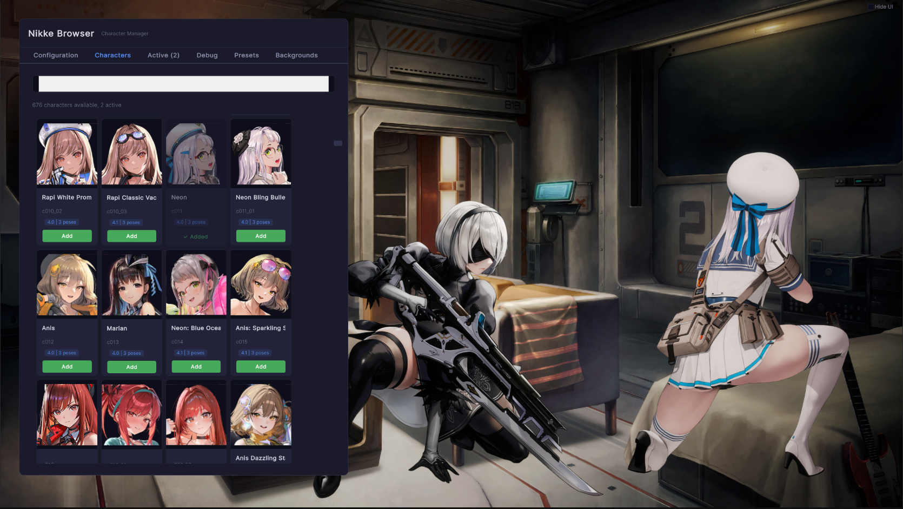

# Nikke Viewer EX

<div align="center">
  
  <br />
  <br />
</div>

Nikke Viewer EX is a tool designed for previewing characters from the game GODDESS OF VICTORY: NIKKE. This viewer allows users to engage with character Spine 2D animations along with audio, providing an immersive and dynamic experience.



## Features

### Modern UI (Press F1)
- **Browser Tab** - Browse characters from a JSON database with auto folder scanning
- **Active Tab** - Manage active characters with scale, show name toggle, pose switching, and remove
- **Debug Tab** - View pose and skeleton debug information
- **Presets Tab** - Save and load character configurations
- **Backgrounds Tab** - Manage multiple background images
- **Config Tab** - General settings (BG, BGM, FPS)

### Character Browser
- Auto folder scanning for character assets
- Search functionality
- Thumbnails display
- Texture variations support (multiple PNGs per character)
- Pose buttons (Base/Cover/Aim)

### Character Interaction
- **Left-click** - Touch interaction (plays voice and animation)
- **Left-click + hold** - Drag character position
- **Scroll wheel** - Scale character
- **Middle-click** - Toggle between Base and Cover poses
- **Right-click hold** - Switch to Aim pose (release to return to Cover)
- **F1** - Toggle UI visibility

### Character Display
- Per-character **Show Name** toggle
- Name label floats above character
- Lock/unlock position and scale

### Background Management
- Background image with scale and pan controls
- Background music with volume and play/pause
- Save multiple backgrounds
- Persistent settings on restart

### Spine Support
- **Spine 4.0** and **Spine 4.1** runtime support
- Automatic version detection from .skel file header
- Both versions can coexist in the same scene

### Settings Persistence
- All settings saved to `settings.json`
- Character list, positions, scales
- Background image and music
- FPS configuration

## How to Use

### Quick Setup

1. Press **F1** to open the browser panel
2. Go to the **Config** tab and set your:
   - **Assets Folder** - Folder containing character assets
   - **Database JSON** - Path to character database (optional)
   - **Thumbnails Folder** - Folder for character thumbnails (optional)
3. Go to the **Browser** tab to view available characters
4. Click **Add** to add a character to your active list
5. Go to the **Active** tab to manage your characters

### Character Asset Structure

```
assetsFolder/{character_id}/
├── {id}_00.skel, .atlas, .png     → Base pose
├── {id}_01.png                    → Texture variation
├── cover/
│   └── {id}_cover_00.skel/atlas/png → Cover pose
└── aim/
    └── {id}_aim_00.skel/atlas/png   → Aim pose
└── Sounds/                          → sounds named properly
```

> [!NOTE]  
> You can download Nikke assets from [nikke-db](https://github.com/Nikke-db/Nikke-db.github.io/tree/main/l2d).

### Asset Download Sources
- [nikke-db](https://github.com/Nikke-db/Nikke-db.github.io) - Character database and assets

## Technical Details

### Requirements
- Unity 6 (6000.0.23f1)
- URP 17.0.3
- Windows

### Dependencies
- UniTask - Async/await framework
- Spine Unity 4.0 & 4.1 - Spine runtime
- Input System 1.11.2 - Input handling
- UI Toolkit - Modern UI system
- TextMeshPro - Text rendering

## Contributing

We welcome contributions to enhance this project! Feel free to suggest improvements, report bugs, or submit pull requests.

## Credits

- [EsotericSoftware](https://github.com/EsotericSoftware)/[spine-unity](http://esotericsoftware.com/spine-unity) - Spine runtime
- [skuqre](https://github.com/skuqre)/[nikke-font-generator](https://github.com/skuqre/nikke-font-generator) - Project logo
- [Ayfel](https://github.com/Ayfel)/[MRTK-Keyboard](https://github.com/Ayfel/MRTK-Keyboard) - On-screen keyboard
- [yasirkula](https://github.com/yasirkula)/
  - [DynamicPanels](https://github.com/yasirkula/UnityDynamicPanels) - Tabbed menu
  - [UnityIngameDebugConsole](https://github.com/yasirkula/UnityIngameDebugConsole) - Debug console
  - [UnitySimpleFileBrowser](https://github.com/yasirkula/UnitySimpleFileBrowser) - File browser
- [gilzoide](https://github.com/gilzoide)/[unity-serializable-collections](https://github.com/gilzoide/unity-serializable-collections) - Serializable collections

## License

This project is licensed under [MIT License](./LICENSE).  
Spine Runtimes is licensed under [Spine Runtimes License Agreement](https://esotericsoftware.com/spine-runtimes-license).
